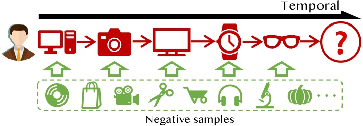

# NS4RS
This repository collects 237 papers related to negative sampling methods in Recommendation Systems (**RS**). Detailed information can be found in our [survey paper](https://arxiv.org/pdf/2409.07237).
We propose a overall ontology of Negative Sampling in Recommendation, which has been divided into five categories: **Static Negative Sampling**, **Dynamic Negative Sampling**, **Adversarial Negative Generation**, **Importance Re-weighting** and **Knowledge-enhanced Negative Sampling**.


- [Ontology](#Ontology)
  - [Static Negative Sampling](#static-negative-sampling)
  - [Dynamic Negative Sampling](#hard-negative-sampling)
  - [Adversarial Negative Generation](#adversarial-sampling)
  - [Importance Re-weighting](#graph-based-sampling)
  - [Knowledge-enhanced Negative Sampling](#additional-data-enhanced-sampling)

- [Scenarios](#Scenarios)
  - [Collaborative-guided Recommendation](#static-negative-sampling)
  - [Sequential Recommendation](#hard-negative-sampling)
  - [Multi-modal Recommendation](#adversarial-sampling)
  - [Multi-behavior Recommendation](#graph-based-sampling)
  - [Cross-domain Recommendation](#additional-data-enhanced-sampling)
  - [CL-enhanced Recommendation](#additional-data-enhanced-sampling)

Ontology


----
### Static Negative Sampling
#### Uniform Static Negative Sampling
<!--
- Atrank: An attention-based user behavior modeling framework for recommendation. `AAAI (2018)` **[[PDF](https://ojs.aaai.org/index.php/AAAI/article/view/11618)]**
- ReCODE: Modeling Repeat Consumption with Neural ODE. `SIGIR (2024)` **[[PDF](https://dl.acm.org/doi/abs/10.1145/3626772.3657936)]**
-	BPR: Bayesian Personalized Ranking from Implicit Feedback. `UAI (2009)` **[[PDF](https://arxiv.org/pdf/1205.2618.pdf)]**
- Neural collaborative filtering. `WWW (2017) - check` **[[PDF](https://dl.acm.org/doi/10.1145/3038912.3052569)]**
- Simplifying Graph-based Collaborative Filtering for Recommendation. `WSDM (2023)` **[[PDF](https://dl.acm.org/doi/10.1145/3539597.3570451)]**
- GCRec: Graph-Augmented Capsule Network for Next-Item Recommendation. `TNNLS (2023)` **[[PDF](https://ieeexplore.ieee.org/abstract/document/9762364)]**
- Multi-behavior hypergraph-enhanced transformer for sequential recommendation. `KDD (2022)` **[[PDF](https://dl.acm.org/doi/abs/10.1145/3534678.3539342)]**
- Knowledge Enhanced Multi-intent Transformer Network for Recommendation. `WWW (2024) - check` **[[PDF](https://dl.acm.org/doi/abs/10.1145/3589335.3648296)]** 
- Generative-contrastive graph learning for recommendation. `SIGIR (2023)` **[[PDF](https://dl.acm.org/doi/abs/10.1145/3539618.3591691)]**
- Graph bottlenecked social recommendation. `KDD (2024)` **[[PDF](https://dl.acm.org/doi/abs/10.1145/3637528.3671807)]**
- Sequential recommendation with multiple contrast signals. `TOIS (2023)` **[[PDF](https://dl.acm.org/doi/abs/10.1145/3522673)]**
- Enhanced generative recommendation via content and collaboration integration. `arxiv (2024) - check` **[[PDF](https://openreview.net/forum?id=donBik41p8)]**
- Contrastive Cross-Domain Sequential Recommendation. `CIKM (2022)` **[[PDF](https://dl.acm.org/doi/abs/10.1145/3511808.3557262)]**
- Making Non-overlapping Matters: An Unsupervised Alignment enhanced Cross-Domain Cold-Start Recommendation. `TKDE (2024)` **[[PDF](https://ieeexplore.ieee.org/abstract/document/10779184/)]**
- Align-for-Fusion: Harmonizing Triple Preferences via Dual-oriented Diffusion for Cross-domain Sequential Recommendation. `arxiv (2025) - check` **[[PDF](https://arxiv.org/abs/2508.05074)]**
- GeoMF: joint geographical modeling and matrix factorization for point-of-interest recommendation. `KDD (2014)` **[[PDF](https://dl.acm.org/doi/abs/10.1145/2623330.2623638)]**
- Neural news recommendation with topic-aware news representation. `ACL (2019)` **[[PDF](https://aclanthology.org/P19-1110/)]**
- Adversarial mahalanobis distance-based attentive song recommender for automatic playlist continuation. `SIGIR (2019)` **[[PDF](https://dl.acm.org/doi/abs/10.1145/3331184.3331234)]**
- CLEAR: Contrastive Learning for API Recommendation. `ICSE (2022)` **[[PDF](https://dl.acm.org/doi/abs/10.1145/3510003.3510159)]**
- Learning tree-based deep model for recommender systems. `KDD (2018)` **[[PDF](https://dl.acm.org/doi/abs/10.1145/3219819.3219826)]**
- Effective and Efficient Training for Sequential Recommendation using Recency Sampling. `RecSys (2022)` **[[PDF](https://dl.acm.org/doi/abs/10.1145/3604436)]**
!-->
| Index | Venue         | Year | Title                                                                                                                    | PDF                                                       |
| :-----: | :-------------: | :----: | ------------------------------------------------------------------------------------------------------------------------ | :--------------------------------------------------------------: |
| 1     | UAI           | 2009 | BPR: Bayesian Personalized Ranking from Implicit Feedback.                                                               | [PDF](https://arxiv.org/pdf/1205.2618.pdf)                     |
| 2    | KDD           | 2014 | GeoMF: joint geographical modeling and matrix factorization for point-of-interest recommendation.                        | [PDF](https://dl.acm.org/doi/abs/10.1145/2623330.2623638)      |
| 3     | WWW   | 2017 | Neural collaborative filtering.                                                                                          | [PDF](https://dl.acm.org/doi/10.1145/3038912.3052569)          |
| 4    | KDD           | 2018 | Learning tree-based deep model for recommender systems.                                                                  | [PDF](https://dl.acm.org/doi/abs/10.1145/3219819.3219826)      |
| 5     | AAAI          | 2018 | Atrank: An attention-based user behavior modeling framework for recommendation.                                          | [PDF](https://ojs.aaai.org/index.php/AAAI/article/view/11618)  |
| 6    | ACL           | 2019 | Neural news recommendation with topic-aware news representation.                                                         | [PDF](https://aclanthology.org/P19-1110/)                      |
| 7    | SIGIR         | 2019 | Adversarial mahalanobis distance-based attentive song recommender for automatic playlist continuation.                   | [PDF](https://dl.acm.org/doi/abs/10.1145/3331184.3331234)      |
| 8    | ICSE          | 2022 | CLEAR: Contrastive Learning for API Recommendation.                                                                      | [PDF](https://dl.acm.org/doi/abs/10.1145/3510003.3510159)      |
| 9    | RecSys        | 2022 | Effective and Efficient Training for Sequential Recommendation using Recency Sampling.                                   | [PDF](https://dl.acm.org/doi/abs/10.1145/3604436)              |
| 10     | KDD           | 2022 | Multi-behavior hypergraph-enhanced transformer for sequential recommendation.                                            | [PDF](https://dl.acm.org/doi/abs/10.1145/3534678.3539342)      |
| 11    | CIKM          | 2022 | Contrastive Cross-Domain Sequential Recommendation.                                                                      | [PDF](https://dl.acm.org/doi/abs/10.1145/3511808.3557262)      |
| 12     | WSDM          | 2023 | Simplifying Graph-based Collaborative Filtering for Recommendation.                                                      | [PDF](https://dl.acm.org/doi/10.1145/3539597.3570451)          |
| 13     | TNNLS         | 2023 | GCRec: Graph-Augmented Capsule Network for Next-Item Recommendation.                                                     | [PDF](https://ieeexplore.ieee.org/abstract/document/9762364)   |
| 14    | SIGIR         | 2023 | Generative-contrastive graph learning for recommendation.                                                                | [PDF](https://dl.acm.org/doi/abs/10.1145/3539618.3591691)      |
| 15    | TOIS          | 2023 | Sequential recommendation with multiple contrast signals.                                                                | [PDF](https://dl.acm.org/doi/abs/10.1145/3522673)              |
| 16    | SIGIR         | 2024 | ReCODE: Modeling Repeat Consumption with Neural ODE.                                                                     | [PDF](https://dl.acm.org/doi/abs/10.1145/3626772.3657936)      |
| 17    | WWW   | 2024 | Knowledge Enhanced Multi-intent Transformer Network for Recommendation.                                                  | [PDF](https://dl.acm.org/doi/abs/10.1145/3589335.3648296)      |
| 18    | KDD           | 2024 | Graph bottlenecked social recommendation.                                                                                | [PDF](https://dl.acm.org/doi/abs/10.1145/3637528.3671807)      |
| 19    | Arxiv | 2024 | Enhanced generative recommendation via content and collaboration integration.                                            | [PDF](https://openreview.net/forum?id=donBik41p8)              |
| 20    | TKDE          | 2024 | Making Non-overlapping Matters: An Unsupervised Alignment enhanced Cross-Domain Cold-Start Recommendation.               | [PDF](https://ieeexplore.ieee.org/abstract/document/10779184/) |
| 21    | KDD | 2026 | Align-for-Fusion: Harmonizing Triple Preferences via Dual-oriented Diffusion for Cross-domain Sequential Recommendation. | [PDF](https://arxiv.org/abs/2508.05074)                        |


#### Predefined Static Negative Sampling
- Efficient latent link recommendation in signed networks. `KDD (2015)` **[[PDF](https://dl.acm.org/doi/abs/10.1145/2783258.2783358)]**
- Adaptive implicit friends identification over heterogeneous network for social recommendation. `CIKM (2018)` **[[PDF](https://dl.acm.org/doi/abs/10.1145/3269206.3271725)]**
- Group-based deep transfer learning with mixed gate control for cross-domain recommendation. `IJCNN (2021)` **[[PDF](https://ieeexplore.ieee.org/abstract/document/9533861/)]**
- On Practical Diversified Recommendation with Controllable Category Diversity Framework. `WWW (2024)` **[[PDF](https://dl.acm.org/doi/abs/10.1145/3589335.3648323)]**
- DRN: A deep reinforcement learning framework for news recommendation. `WWW (2018)` **[[PDF](https://dl.acm.org/doi/abs/10.1145/3178876.3185994)]**
- Efficient latent link recommendation in signed networks. `KDD (2015)` **[[PDF](https://dl.acm.org/doi/abs/10.1145/2783258.2783358)]**
- Adaptive implicit friends identification over heterogeneous network for social recommendation. `KDD (2018)` **[[PDF](https://dl.acm.org/doi/abs/10.1145/3269206.3271725)]**
- Sequential recommendation with dual side neighbor-based collaborative relation modeling. `WSDM (2020)` **[[PDF](https://dl.acm.org/doi/abs/10.1145/3336191.3371842)]**
- Rella: Retrieval-enhanced large language models for lifelong sequential behavior comprehension in recommendation. `WWW (2024)` **[[PDF](https://dl.acm.org/doi/abs/10.1145/3589334.3645467)]**
- Towards open-world recommendation with knowledge augmentation from large language models. `RecSys (2024)` **[[PDF](https://dl.acm.org/doi/abs/10.1145/3640457.3688104)]**
- Uncovering ChatGPT\'s Capabilities in Recommender Systems. `RecSys (2023)` **[[PDF](https://dl.acm.org/doi/abs/10.1145/3604915.3610646)]**
- Ctrl: Connect collaborative and language model for ctr prediction. `RecSys (2023)` **[[PDF](https://dl.acm.org/doi/abs/10.1145/3713080)]**


#### Popularity-based Static Negative Sampling
- Personalized ranking for non-uniformly sampled items. `KDD Cup/PLMR - check (2012)` **[[PDF](http://proceedings.mlr.press/v18/gantner12a.html)]**
- Learning recommender systems with implicit feedback via soft target enhancement. `SIGIR (2021)` **[[PDF](https://dl.acm.org/doi/abs/10.1145/3404835.3462863)]**
- Point-of-interest recommendation: Exploiting self-attentive autoencoders with neighbor-aware influence. `CIKM (2018)` **[[PDF](https://dl.acm.org/doi/abs/10.1145/3269206.3271733)]**
- Improving pairwise learning for item recommendation from implicit feedback. `WSDM (2014)` **[[PDF](https://dl.acm.org/doi/abs/10.1145/2556195.2556248)]**
- Alleviating cold-start problems in recommendation through pseudo-labelling over knowledge graph. `WSDM (2021)` **[[PDF](https://dl.acm.org/doi/abs/10.1145/3437963.3441773)]**
- Multi-task feature learning for knowledge graph enhanced recommendation. `WWW (2019)` **[[PDF](https://dl.acm.org/doi/abs/10.1145/3308558.3313411)]**
- Learning from history and present: Next-item recommendation via discriminatively exploiting user behaviors. `KDD (2018)` **[[PDF](https://dl.acm.org/doi/abs/10.1145/3219819.3220014)]**
- Fast matrix factorization for online recommendation with implicit feedback. `SIGIR (2016)` **[[PDF](https://dl.acm.org/doi/abs/10.1145/2911451.2911489)]**
- Hyperbolic graph learning for social recommendation. `TKDE (2023)` **[[PDF](https://ieeexplore.ieee.org/abstract/document/10361607/)]**
- Effective and Efficient Training for Sequential Recommendation using Recency Sampling. `RecSys (2022)` **[[PDF](https://dl.acm.org/doi/abs/10.1145/3604436)]**
- Distributed Representations of Words and Phrases and their Compositionality. `NeurIPS (2013)` **[[PDF](https://proceedings.neurips.cc/paper/2013/hash/9aa42b31882ec039965f3c4923ce901b-Abstract.html)]**


#### Non-sampling Static Negative Sampling
- Efficient heterogeneous collaborative filtering without negative sampling for recommendation. `AAAI (2020)` **[[PDF](https://aaai.org/ojs/index.php/AAAI/article/view/5329)]**
- Efficient neural matrix factorization without sampling for recommendation. `TOIS (2020)` **[[PDF](https://dl.acm.org/doi/abs/10.1145/3373807)]**
- An Efficient Adaptive Transfer Neural Network for Social-Aware Recommendation. `SIGIR (2019)` **[[PDF](https://dl.acm.org/doi/abs/10.1145/3331184.3331192)]**
- Efficient non-sampling factorization machines for optimal context-aware recommendation. `WWW (2020)` **[[PDF](https://dl.acm.org/doi/abs/10.1145/3366423.3380303)]**
- Efficient non-sampling knowledge graph embedding. `WWW (2021)` **[[PDF](https://dl.acm.org/doi/abs/10.1145/3442381.3449859)]**


### Dynamic Negative Sampling
- Optimizing top-n collaborative filtering via dynamic negative item sampling. `SIGIR (2013)` **[[PDF](https://dl.acm.org/doi/abs/10.1145/2484028.2484126)]**

#### Universal Dynamic Negative Sampling
- Optimizing top-n collaborative filtering via dynamic negative item sampling. `SIGIR (2013)` **[[PDF](https://dl.acm.org/doi/abs/10.1145/2484028.2484126)]**
- Leveraging meta-path based context for top-n recommendation with a neural co-attention model. `KDD (2018)` **[[PDF]()]**
- ITSM-GCN: Informative Training Sample Mining for Graph Convolutional Network-based Collaborative Filtering. `CIKM (2022)` **[[PDF]()]**
- Fashion recommendation with multi-relational representation learning. `KDD (2020)` **[[PDF]()]**
- Graph convolutional neural networks for web-scale recommender systems. `KDD (2018)` **[[PDF]()]**
- On the theories behind hard negative sampling for recommendation. `WWW (2023)` **[[PDF]()]**
- Collaborative distillation for top-N recommendation. `ICDM (2019)` **[[PDF]()]**
- DE-RRD: A knowledge distillation framework for recommender system. `CIKM (2019)` **[[PDF]()]**
- Plug-in Diffusion Model for Sequential Recommendation. `AAAI (2024)` **[[PDF]()]**
- Exploring False Hard Negative Sample in Cross-Domain Recommendation. `RecSys (2023)` **[[PDF]()]**

#### User-similarity Dynamic Negative Sampling
- Dual sequential prediction models linking sequential recommendation and information dissemination. `KDD (2019)` **[[PDF]()]**
- SamWalker++: recommendation with informative sampling strategy. `TKDE (2021)` **[[PDF]()]**
- Triplet Losses-based Matrix Factorization for Robust Recommendations. `? (2022)` **[[PDF]()]**
- SamWalker: Social Recommendation with Informative Sampling Strategy. `WWW (2019)` **[[PDF]()]**


#### Knowledge-aware Dynamic Negative Sampling
- Geography-aware sequential location recommendation. `KDD (2020)` **[[PDF]()]**
- Fairly Adaptive Negative Sampling for Recommendations. `WWW (2023)` **[[PDF]()]**
- Context-aware image tweet modelling and recommendation. `MM (2016)` **[[PDF]()]**
- Leveraging review properties for effective recommendation. `WWW (2021)` **[[PDF]()]**

#### Distribution-based Dynamic Negative Sampling
- A Gain-Tuning Dynamic Negative Sampler for Recommendation. `WWW (2022)` **[[PDF]()]**
- Simplify and robustify negative sampling for implicit collaborative filtering. `NIPS (2020)` **[[PDF]()]**
- Disentangled Negative Sampling for Collaborative Filtering. `WSDM (2023)` **[[PDF]()]**

#### Interpolation Dynamic Negative Sampling
- Mixgcf: An improved training method for graph neural network-based recommender systems. `KDD (2021)` **[[PDF]()]**
- Soft BPR Loss for Dynamic Hard Negative Sampling in Recommender Systems. `ARXIV (2022)` **[[PDF]()]**
- Optimizing top-n collaborative filtering via dynamic negative item sampling. `SIGIR (2013)` **[[PDF]()]**


#### Mixed Dynamic Negative Sampling
- On sampling strategies for neural network-based collaborative filtering. `KDD (2017)` **[[PDF]()]**
- Estimation-action-reflection: Towards deep interaction between conversational and recommender systems. `WSDM (2020)` **[[PDF]()]**
- Recurrent neural networks with top-k gains for session-based recommendations. `CIKM (2018)` **[[PDF]()]**
- Session-based recommendations with recurrent neural networks. `ARXIV (2015)` **[[PDF]()]**
- Embedding-based retrieval in facebook search. `KDD (2020)` **[[PDF]()]**
- Mixed negative sampling for learning two-tower neural networks in recommendations. `WWW (2020)` **[[PDF]()]**
- Adapting user preference to online feedback in multi-round conversational recommendation. `WSDM (2021)` **[[PDF]()]**


### Adversarial Negative Generation

#### Generative Adversarial Negative Generation
- Generative Adversarial Networks. `NIPS (2014)` **[[PDF]()]**
- Neural memory streaming recommender networks with adversarial training. `KDD (2018)` **[[PDF]()]**
- DRCGR: Deep reinforcement learning framework incorporating CNN and GAN-based for interactive recommendation. `ICDM (2O19)` **[[PDF]()]**
- LARA: Attribute-to-feature adversarial learning for new-item recommendation. `WSDM (2020)` **[[PDF]()]**
- Reinforced Negative Sampling for Recommendation with Exposure Data. `IJCAI (2019)` **[[PDF]()]**
- Adversarial feature translation for multi-domain recommendation. `KDD (2021)` **[[PDF]()]**
- A peep into the future: Adversarial future encoding in recommendation. `WSDM (2022)` **[[PDF]()]**
- ELECRec: Training Sequential Recommenders as Discriminators. `SIGIR (2022)` **[[PDF]()]**
- PURE: Positive-unlabeled recommendation with generative adversarial network. `KDD (2021)` **[[PDF]()]**


#### Sampled Adversarial Negative Generation
- Irgan: A minimax game for unifying generative and discriminative information retrieval models. `SIGIR (2017)` **[[PDF]()]**
- Graphgan: Graph representation learning with generative adversarial nets. `AAAI (2018)` **[[PDF]()]**
  

### Importance Re-weighting
- User response models to improve a reinforce recommender system. `WSDM (2021)` **[[PDF](https://dl.acm.org/doi/abs/10.1145/3437963.3441764)]**
- Transfer learning via contextual invariants for one-to-many cross-domain recommendation. `SIGIR (2020)` **[[PDF](https://dl.acm.org/doi/abs/10.1145/3397271.3401078)]**
- Influence function for unbiased recommendation. `SIGIR (2020)` **[[PDF](https://dl.acm.org/doi/abs/10.1145/3397271.3401321)]**
- BSPR: Basket-sensitive personalized ranking for product recommendation. `Information Sciences (2020)` **[[PDF](https://www.sciencedirect.com/science/article/pii/S0020025520306344)]**
- Cross-domain Recommendation with Behavioral Importance Perception. `WWW (2023)` **[[PDF](https://dl.acm.org/doi/abs/10.1145/3543507.3583494)]**
- Learning explicit user interest boundary for recommendation. `WWW (2022)` **[[PDF](https://dl.acm.org/doi/abs/10.1145/3485447.3511971)]**
- SamWalker++: recommendation with informative sampling strategy. `TKDE (2021)` **[[PDF[]()]**](https://ieeexplore.ieee.org/abstract/document/9507306/)
- Fairly Adaptive Negative Sampling for Recommendations. `WWW (2023)` **[[PDF](https://dl.acm.org/doi/abs/10.1145/3543507.3583355)]**


#### Attention-based Importance Re-weighting
- Self-guided learning to denoise for robust recommendation. `SIGIR (2022)` **[[PDF]()]**
- User response models to improve a reinforce recommender system. `WSDM (2021)` **[[PDF]()]**
- Modeling User Attention in Music Recommendation. `ICDE (2024)` **[[PDF]()]**
- Cross-domain Recommendation with Behavioral Importance Perception. `WWW (2023)` **[[PDF]()]**
- Learning explicit user interest boundary for recommendation. `WWW (2022)` **[[PDF]()]**
- Recommendations with negative feedback via pairwise deep reinforcement learning. `KDD (2018)` **[[PDF]()]**
- Personalized ranking with importance sampling. `WWW (2020)` **[[PDF]()]**
- Top-k off-policy correction for a REINFORCE recommender system. `WSDM (2019)` **[[PDF]()]**
- Self-guided learning to denoise for robust recommendation. `SIGIR (2022)` **[[PDF]()]**


#### Knowledge-aware Importance Re-weighting
- Dgrec: Graph neural network for recommendation with diversified embedding generation. `WSDM (2023)` **[[PDF]()]**
- Premere: Meta-reweighting via self-ensembling for point-of-interest recommendation. `AAAI (2021)` **[[PDF]()]**
- User response models to improve a reinforce recommender system. `WSDM (2021)` **[[PDF]()]**


#### Debiased Importance Re-weighting
- SAR-Net: A scenario-aware ranking network for personalized fair recommendation in hundreds of travel scenarios. `CIKM (2021)` **[[PDF]()]**
- Influence function for unbiased recommendation. `SIGIR (2020)` **[[PDF]()]**
- Headache to Overstock? Promoting Long-tail Items through Debiased Product Bundling. `ARXIV (2024)` **[[PDF]()]**


### Knowledge-enhanced Negative Sampling


#### General Knowledge-enhanced Negative Sampling
- Calibrated recommendations. `RecSys (2018)` **[[PDF]()]**
- Mining affective text to improve social media item recommendation. `Processing Management (2015)` **[[PDF]()]**
- Intentgc: a scalable graph convolution framework fusing heterogeneous information for recommendation. `KDD (2019)` **[[PDF]()]**
- Uniform Random Sampling Not Recommended. `WWW (2018)` **[[PDF]()]**


#### KG-based Knowledge-enhanced Negative Sampling
- Reinforced anchor knowledge graph generation for news recommendation reasoning. `KDD (2021)` **[[PDF]()]**
- Paper recommendation based on heterogeneous network embedding. `Knowledge-Based Systems (2020)` **[[PDF]()]**
- Reinforced negative sampling over knowledge graph for recommendation. `WWW (2020)` **[[PDF]()]**
- Knowledge-enhanced Black-box Attacks for Recommendations. `KDD (2022)` **[[PDF]()]**

  

Scenarios
----
### Collaborative-guided Recommendation


- BPR: Bayesian personalized ranking from implicit feedback. `UAI (2009)` **[[PDF](https://arxiv.org/abs/1205.2618)]**
- Neural collaborative filtering. `WWW (2017)` **[[PDF](https://dl.acm.org/doi/abs/10.1145/3038912.3052569)]**
- Optimizing top-n collaborative filtering via dynamic negative item sampling. `SIGIR (2013)` **[[PDF](https://dl.acm.org/doi/abs/10.1145/2484028.2484126)]**
- On the theories behind hard negative sampling for recommendation. `WWW (2023)` **[[PDF](https://dl.acm.org/doi/abs/10.1145/3543507.3583223)]**
- Efficient neural matrix factorization without sampling for recommendation. `TOIS (2020)` **[[PDF](https://dl.acm.org/doi/abs/10.1145/3373807)]**
- Simplify and robustify negative sampling for implicit collaborative filtering. `NeurIPS (2020)` **[[PDF](https://proceedings.neurips.cc/paper/2020/hash/0c7119e3a6a2209da6a5b90e5b5b75bd-Abstract.html)]**
- Adapting Triplet Importance of Implicit Feedback for Personalized Recommendation. `CIKM (2022)` **[[PDF](https://dl.acm.org/doi/abs/10.1145/3511808.3557229)]**
- Simplifying Graph-based Collaborative Filtering for Recommendation. `WSDM (2023)` **[[PDF](https://dl.acm.org/doi/abs/10.1145/3539597.3570451)]**
- A Gain-Tuning Dynamic Negative Sampler for Recommendation. `WWW (2022)` **[[PDF](https://dl.acm.org/doi/abs/10.1145/3485447.3511956)]**
- Disentangled Negative Sampling for Collaborative Filtering. `WSDM (2023)` **[[PDF](https://dl.acm.org/doi/abs/10.1145/3539597.3570419)]**
- Enhanced graph learning for collaborative filtering via mutual information maximization. `SIGIR (2021)` **[[PDF](https://dl.acm.org/doi/abs/10.1145/3404835.3462928)]**

### Sequential Recommendation



- A case study on sampling strategies for evaluating neural sequential item recommendation models. `RecSys (2021)` **[[PDF](https://dl.acm.org/doi/abs/10.1145/3460231.3475943)]**
- Sequential recommendation with multiple contrast signals. `TOIS (2023)` **[[PDF](https://dl.acm.org/doi/abs/10.1145/3522673)]**
- Dual sequential prediction models linking sequential recommendation and information dissemination. `KDD (2019)` **[[PDF](https://dl.acm.org/doi/abs/10.1145/3292500.3330959)]**
- ELECRec: Training Sequential Recommenders as Discriminators. `SIGIR (2022)` **[[PDF](https://dl.acm.org/doi/abs/10.1145/3477495.3531894)]**
- Contrastive learning for sequential recommendation. `ICDE (2022)` **[[PDF](https://ieeexplore.ieee.org/abstract/document/9835621/)]**
- Geography-aware sequential location recommendation. `KDD (2020)` **[[PDF](https://dl.acm.org/doi/abs/10.1145/3394486.3403252)]**


### Multi-modal Recommendation


- Self-supervised learning for multimedia recommendation. `TMM (2022)` **[[PDF](https://ieeexplore.ieee.org/abstract/document/9811387/)]**
- Prompt-based and weak-modality enhanced multimodal recommendation. `Information Fusion (2024)` **[[PDF](https://www.sciencedirect.com/science/article/pii/S1566253523003056)]**
- Personalized multimedia item and key frame recommendation. `IJCAI (2019)` **[[PDF](https://arxiv.org/abs/1906.00246)]**
- Multi-task feature learning for knowledge graph enhanced recommendation. `WWW (2019)` **[[PDF](https://dl.acm.org/doi/abs/10.1145/3308558.3313411)]**
  
  
### Multi-behavior Recommendation


- Deep feedback network for recommendation. `IJCAI (2021)` **[[PDF](https://www.ijcai.org/Proceedings/2020/0349.pdf)]**
- Negative can be positive: Signed graph neural networks for recommendation. `IP&M (2023)` **[[PDF](https://www.sciencedirect.com/science/article/pii/S0306457323001401)]**
- Interpretable User Retention Modeling in Recommendation. `RecSys (2023)` **[[PDF](https://dl.acm.org/doi/abs/10.1145/3604915.3608818)]**
- Multi-Behavior Graph Neural Networks for Recommender System. `TNNLS (2022)` **[[PDF](https://ieeexplore.ieee.org/abstract/document/9925059/)]**
- Self-Supervised Learning on Users' Spontaneous Behaviors for Multi-Scenario Ranking in E-commerce. `CIKM (2021)` **[[PDF](https://dl.acm.org/doi/abs/10.1145/3459637.3481953)]**
- SAQRec: Aligning Recommender Systems to User Satisfaction via Questionnaire Feedback. `CIKM (2024)` **[[PDF](https://dl.acm.org/doi/abs/10.1145/3627673.3679643)]**
- Atrank: An attention-based user behavior modeling framework for recommendation. `AAAI (2018)` **[[PDF](https://ojs.aaai.org/index.php/AAAI/article/view/11618)]**
- Hyper meta-path contrastive learning for multi-behavior recommendation. `ICDM (2021)` **[[PDF](https://ieeexplore.ieee.org/abstract/document/9678992)]**
- DRN: A deep reinforcement learning framework for news recommendation. `WWW (2018)` **[[PDF](https://dl.acm.org/doi/abs/10.1145/3178876.3185994)]**
- Self-supervised Graph Neural Networks for Multi-behavior Recommendation. `IJCAI (2022)` **[[PDF](http://www.shichuan.org/doc/134.pdf)]**

  
### Cross-domain Recommendation


- Triple sequence learning for cross-domain recommendation. `TOIS (2024)` **[[PDF](https://dl.acm.org/doi/abs/10.1145/3638351)]**
- DCDIR: A deep cross-domain recommendation system for cold start users in insurance domain. `SIGIR (2020)` **[[PDF](https://dl.acm.org/doi/abs/10.1145/3397271.3401193)]**
- Cross domain recommendation via bi-directional transfer graph collaborative filtering networks. `CIKM (2020)` **[[PDF](https://dl.acm.org/doi/abs/10.1145/3340531.3412012)]**
- Collaborative filtering with a deep adversarial and attention network for cross-domain recommendation. `Information Sciences (2021)` **[[PDF](https://www.sciencedirect.com/science/article/pii/S0020025521001432)]**
- Exploring False Hard Negative Sample in Cross-Domain Recommendation. `RecSys (2023)` **[[PDF](https://dl.acm.org/doi/abs/10.1145/3604915.3608791)]**
  

### CL-enhanced Recommendation
- Dual contrastive learning for unsupervised image-to-image translation. `CVPR (2021)` **[[PDF](http://openaccess.thecvf.com/content/CVPR2021W/NTIRE/html/Han_Dual_Contrastive_Learning_for_Unsupervised_Image-to-Image_Translation_CVPRW_2021_paper.html)]**
- Self-Guided Contrastive Learning for BERT Sentence Representations. `arixv (2021)` **[[PDF](https://arxiv.org/abs/2106.07345)]**
- Simple unsupervised graph representation learning. `AAAI (2022)` **[[PDF](https://ojs.aaai.org/index.php/AAAI/article/view/20748)]**
- A review-aware graph contrastive learning framework for recommendation. `SIGIR (2022)` **[[PDF](https://dl.acm.org/doi/abs/10.1145/3477495.3531927)]**
- ContrastVAE: Contrastive Variational AutoEncoder for Sequential Recommendation. `CIKM (2022)` **[[PDF](https://dl.acm.org/doi/abs/10.1145/3511808.3557268)]**
- S3-rec: Self-supervised learning for sequential recommendation with mutual information maximization. `CIKM (2020)` **[[PDF](https://dl.acm.org/doi/abs/10.1145/3340531.3411954)]**
- Towards Robust Recommendation via Decision Boundary-aware Graph Contrastive Learning. `KDD (2024)` **[[PDF](https://dl.acm.org/doi/abs/10.1145/3637528.3671661)]**
- Contrastive Learning with Bidirectional Transformers for Sequential Recommendation. `CIKM (2022)` **[[PDF](https://dl.acm.org/doi/abs/10.1145/3511808.3557266)]**
- Causerec: Counterfactual user sequence synthesis for sequential recommendation. `SIGIR (2021)` **[[PDF](https://dl.acm.org/doi/abs/10.1145/3404835.3462908)]**
- Double-scale self-supervised hypergraph learning for group recommendation. `CIKM (2021)` **[[PDF](https://dl.acm.org/doi/abs/10.1145/3459637.3482426)]**
- Self-supervised graph learning for recommendation. `SIGIR (2021)` **[[PDF](https://dl.acm.org/doi/abs/10.1145/3404835.3462862)]**
- CrossCBR: cross-view contrastive learning for bundle recommendation. `KDD (2022)` **[[PDF](https://dl.acm.org/doi/abs/10.1145/3534678.3539229)]**
- Temporal Contrastive Pre-Training for Sequential Recommendation. `CIKM (2022)` **[[PDF](https://dl.acm.org/doi/abs/10.1145/3511808.3557468)]**
- Contrastive learning for cold-start recommendation. `MM (2021)` **[[PDF](https://dl.acm.org/doi/abs/10.1145/3474085.3475665)]**


## BibTeX
If you find this work useful for your research, please kindly cite NS4RS by:
```
@misc{NS4RS,
      title={Negative Sampling in Recommendation: A Survey and Future Directions}, 
      author={Haokai Ma and Ruobing Xie and Lei Meng and Fuli Feng and Xiaoyu Du and Xingwu Sun and Zhanhui Kang and Xiangxu Meng},
      year={2024},
      eprint={2409.07237},
      archivePrefix={arXiv},
      primaryClass={cs.IR},
      url={https://arxiv.org/abs/2409.07237}, 
}
```
